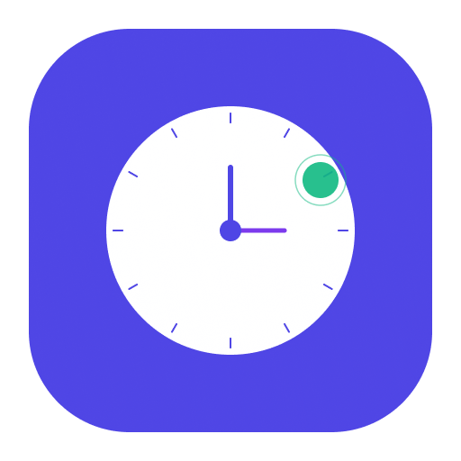

# Amber

<p align="center">
    
    <br>
    <strong>Smart, Private & Local Activity Tracking</strong>
    <br>
    <em>No cloud. No subscription. Your data, your privacy.</em>
</p>

---

## 🚀 About

**Amber** is a privacy-first desktop application built with **NativePHP**. It helps you track your daily activities, manage projects, and generate intelligent
reports without ever sending your sensitive data to the cloud.

The app sits in your menu bar, silently recording your activity events (file changes, app usage, etc.) and uses local/secure AI to help you summarize your day into professional
activity reports.

## ✨ Key Features

- **🛡️ Privacy First:** All activity data is stored locally in a SQLite database. No tracking, no external servers.
- **⌨️ Keyboard-First:** Command palette (`Cmd+K`) for quick navigation, creation, and session control. Native macOS menu hotkeys (`Cmd+1–7`, `Cmd+Shift+S/C/P`) for every action.
- **⏱️ Smart Session Tracking:** Start, stop, and switch between projects directly from your menu bar. Add quick notes to an active session from the title bar.
- **📁 Project & Client Management:** Organize your work by client and project for precise billing or personal tracking.
- **🔍 Multi-Source Activity Detection:** Automatically capture activity from Git commits, GitHub PRs, Claude Code sessions, file system changes (fswatch), Gemini, Mistral Vibe, and Opencode.
- **📅 Timeline & Time Entries:** Review, edit, and reconstruct your work sessions day by day with intelligent gap detection and rounding strategies. Reconstruct missing time directly from the dashboard.
- **🤖 AI-Powered Reports:** Automatically summarize your activity into professional monthly reports (CRA) using the Laravel AI SDK — supports Mistral, OpenAI, Anthropic, and Ollama.
- **📊 Export Options:** Generate activity reports in PDF and Excel formats, ready to send to clients.
- **🔔 Native Integration:** System notifications and a dedicated menu bar interface with real-time session status.
- **🔗 Deep Link Support:** Trigger session actions from external tools (Raycast, Alfred, scripts) using `amber://` URLs.

## 🖥 Platform Support

Amber currently targets **macOS and Linux** only. Windows is not supported at this time.

| Platform | Status |
|----------|--------|
| macOS | ✅ Fully supported |
| Linux | ✅ Supported |
| Windows | ❌ Not supported |

## 🖼 Screenshots

*Coming soon...*

> [!TIP]
> This section will be updated with the final UI once the first stable version is released.

## 🔗 Deep Linking

Amber supports deep links via the `amber://` URL scheme, allowing external tools (Raycast, Alfred, shell scripts, etc.) to control the app remotely.

### Session Control

| URL | Action |
|-----|--------|
| `amber://session/start?project=<id>` | Start a session on the given project |
| `amber://session/start` | Start a session on the first active project |
| `amber://session/stop` | Stop the currently active session |
| `amber://session/toggle?project=<id>` | Start a session if none is active, stop it otherwise |
| `amber://session/switch?project=<id>` | Switch the active session to a different project (starts one if none is running) |

### Navigation

| URL | Action |
|-----|--------|
| `amber://navigate/dashboard` | Open the Dashboard |
| `amber://navigate/timeline` | Open the Timeline |
| `amber://navigate/reports` | Open the Activity Reports |
| `amber://navigate/clients` | Open the Clients list |
| `amber://navigate/projects` | Open the Projects list |
| `amber://navigate/sessions` | Open the Sessions list |
| `amber://navigate/activity` | Open the Activity log |
| `amber://navigate/settings` | Open Settings |

### Utilities

| URL | Action |
|-----|--------|
| `amber://activity/sync` | Scan all enabled activity sources and show a native notification with the result |

**Example — open from terminal:**
```bash
open "amber://session/start?project=<project-ulid>"
open "amber://session/toggle?project=<project-ulid>"
open "amber://navigate/timeline"
open "amber://activity/sync"
```

## 🛠 Tech Stack

Amber is built with the latest modern web and desktop technologies:

- **Framework:** [Laravel 12](https://laravel.com)
- **Desktop Engine:** [NativePHP](https://nativephp.com)
- **Frontend:** [Vue 3](https://vuejs.org) with [Inertia.js v2](https://inertiajs.com)
- **Styling:** [Tailwind CSS v4](https://tailwindcss.com)
- **Database:** SQLite
- **AI Integration:** [Laravel AI SDK](https://github.com/laravel/ai)
- **Testing:** [Pest 4](https://pestphp.com)

## 📦 Installation

### For macOS Users (Pre-built App)

Amber is distributed as an **unsigned macOS application**. This means macOS will warn you the first time you open it, because it hasn't been notarized with an Apple Developer certificate.

**This is expected and safe.** Here's how to open it:

1. **Download** the latest `.dmg` from the [Releases](https://github.com/ngiraud/amber/releases) page.
2. **Mount** the `.dmg` and drag Amber to your Applications folder.
3. **Remove the quarantine attribute** by running this command in Terminal:
   ```bash
   xattr -cr /Applications/Amber.app
   ```
4. Open Amber normally.

You only need to do this once. After that, Amber opens normally.

> [!TIP]
> On older macOS versions you may instead right-click the app → **Open** → click **Open**, or go to **System Settings → Privacy & Security → Open Anyway**. On macOS Sequoia and later, the `xattr` command above is the only reliable method.

> [!NOTE]
> Auto-updates are disabled in unsigned builds. To update, download and reinstall the latest release manually from the Releases page.

---

### For Developers

If you want to run the application from source or contribute to its development:

1. **Clone the repository:**
   ```bash
   git clone https://github.com/ngiraud/amber.git
   cd amber
   ```

2. **Install dependencies:**
   ```bash
   composer install
   npm install
   ```

3. **Set up your environment:**
   ```bash
   cp .env.example .env
   php artisan key:generate
   ```

4. **Prepare the database:**
   ```bash
   php artisan native:migrate --seed
   ```

5. **Run the application:**
   ```bash
   composer native:dev
   ```

## ⚖️ License

This project is open-sourced software licensed under the **[MIT license](LICENSE)**.

---

<p align="center">
    Built with ❤️ using <strong>NativePHP</strong> & <strong>Laravel</strong>.
</p>
